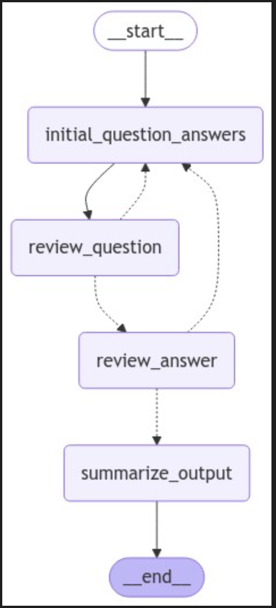
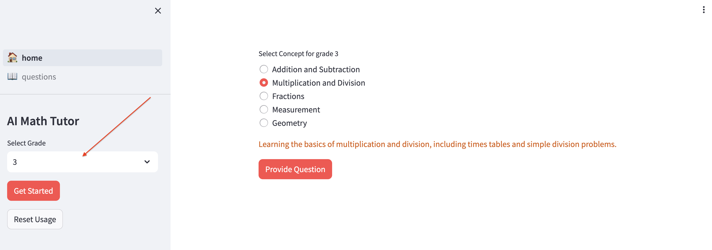
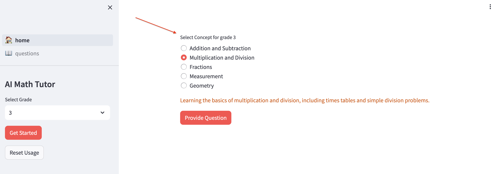
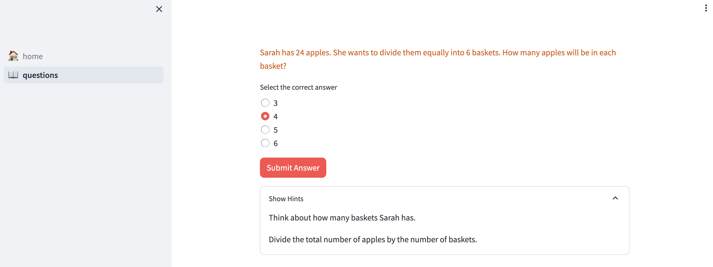
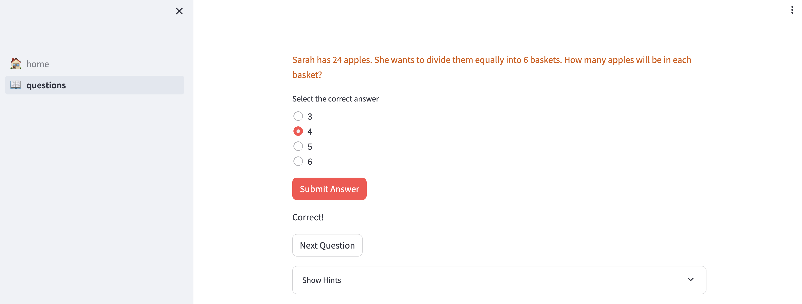

# AI Assistant Math App

This repository contains an AI-driven math tutor application built with Streamlit. The app helps users practice math concepts by providing questions based on their grade level and offering feedback on their answers.

## Features

- Select grade level from pre-K to 12th grade.
- Receive math concepts tailored to the selected grade.
- Answer questions related to the chosen math concept.
- View hints for each question.

## Backend Architecture

The application uses LangGraph to create a reliable and controllable workflow for generating and validating math questions. LangGraph enables a structured approach to building AI agents while maintaining high reliability.

### Question Generation Workflow

The backend implements a sophisticated state machine using LangGraph that follows these steps:

1. Initial Question Generation: Creates a math question based on grade level and concept
2. Question Validation: Ensures the question is clear and contains all necessary information
3. Answer Validation: Verifies that multiple choice options include a correct answer
4. State Management: Tracks the entire process including any necessary revisions



### Key Benefits of LangGraph Implementation

- **Reliability**: Structured workflow ensures consistent question generation and validation
- **State Management**: Comprehensive tracking of the question generation process
- **Debug Capability**: Clear visibility into each step of the workflow
- **Human Oversight**: Message history tracking for review and improvement
- **Error Handling**: Robust error recovery with automatic revision attempts

## Technical Implementation

### Backend Workflow

The backend uses LangGraph's StateGraph to implement a sophisticated question generation and validation workflow:

```python
def create_question_workflow():
    workflow = StateGraph(GraphState)

    workflow.add_node("initial_question_answers", initial_question_answers)
    workflow.add_node("review_question", review_question)
    workflow.add_node("review_answer", review_answer)
    workflow.add_node("summarize_output", summarize_output)

    workflow.set_entry_point("initial_question_answers")
    workflow.add_edge("initial_question_answers", "review_question")

    workflow.add_conditional_edges(
        source="review_question",
        path=review_question_decision,
        path_map={
            "initial_question_answers": "initial_question_answers",
            "review_answer": "review_answer",
        },
    )

    workflow.add_conditional_edges(
        source="review_answer",
        path=review_answer_decision,
        path_map={
            "summarize_output": "summarize_output",
            "initial_question_answers": "initial_question_answers",
        },
    )

    workflow.add_edge("summarize_output", END)

    return workflow.compile()
```

## Installation

To run the AI Assistant Math App locally using Docker and Make, follow these steps:

1. **Clone the repository:**
   ```bash
   git clone https://github.com/yourusername/ai-assistant-math-app.git
   cd ai-assistant-math-app
   ```

2. **Update your config variables and save new file called `dev.env`:**
   ```
   BACKEND_HOST=http://<ip_address>:1001/
   OPENAI_API_KEY=
   ```
3. **Build and start the services:**
   ```bash
   make up
   ```

## Usage

1. **Select Grade:**
   - Use the sidebar to select the grade level of the user.
   

2. **Get Key Math Concepts:**
   - Click the "Get Started" button in the sidebar to retrieve key math concepts for the selected grade.
   

3. **Review Question:**
   - Review Question 
   

4. **Answer Questions:**
   - The app will present a math problem related to the chosen concept.
   - Select the correct answer from the multiple-choice options and submit your answer.
   - If the answer is correct, you'll see a success message and can proceed to the next question.
   - If the answer is incorrect, you'll be prompted to try again.
   

4. **View Hints:**
   - If you need help, expand the "Show Hints" section to see hints for the current question.

## Project Structure

- `fast_api/app/api/genai.py`: LangGraph-powered backend for intelligent question generation and validation
- `🏠_home.py`: Home page application file.
- `pages/📖_questions.py`: Secondary page for presenting questions.
- `utils/api_connector.py`: Contains functions for interacting with the AI API to get math concepts and questions.
- `requirements.txt`: List of dependencies required to run the application.
- `Makefile`: Contains Make commands for managing Docker services.
- `docker-compose-dev.yml`: Docker Compose configuration for development environment.

## Makefile Commands

- `make up`: Build and start the services using Docker Compose.
- `make stop-be`: Stop and remove the backend service container.
- `make stop-fe`: Stop and remove the frontend service container.
- `make logs`: Tail logs for all services.
- `make logs-be`: Tail logs for the backend service.
- `make logs-fe`: Tail logs for the frontend service.

## Contributing

Contributions are welcome! If you have suggestions for improvements or new features, please open an issue or create a pull request.

## License

This project is licensed under the MIT License. See the [LICENSE](LICENSE) file for details.

## Acknowledgements

- Streamlit for providing an easy-to-use framework for building web applications.
- The developers of the AI model for their work in creating the math concept and question generation API.
